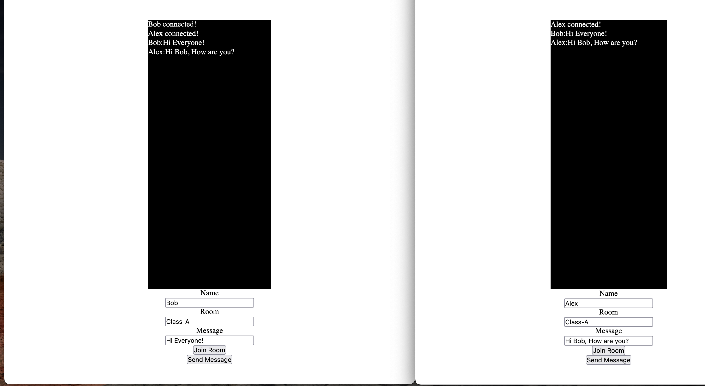

# Chat App With Room

## Get The Project

```bash
  git clone git@github.com:CanAran-Coder/Chat-App-With-Room.git
```

## Technologies

### Frontend
- React(Typescript)
- socket.io-client

### Backend
- Express
- Socket.io
- Ts-node
- Nodemon

## Main Idea About Chat Apps

- First of all need to you add listener to backend server with ```bash io.on("connection",socket) ```.(Remember ```bash .on ``` adds listener.)
- Then ; when socket connected, it adds listener to socket with socket.on("<YOUR_KEY>",Params).That means "I am listening <YOUR_KEY>".
- Lets look at the frontend.
- We defined const socket = io("<BACKEND_URL>").This is User's socket.
- We can send everything with socket.emit("<YOUR_KEY>",Data).(Emit means send to backend and you need to enter your key which is listening in the backend.)
- Remember if you use io.emit , it will send everyone's socket.If you use socket.emit it will send for one.(Forexample backend.)
- Generally useEffect part is hard to understand.We are listening our key(I want to call it chatMSG).If backend sends message with chatMSG key we can catch it with parameter.Return part means when you close the component(Change router with react-router or close the web site) remove listener(you need to specify with "".

## Screenshots

